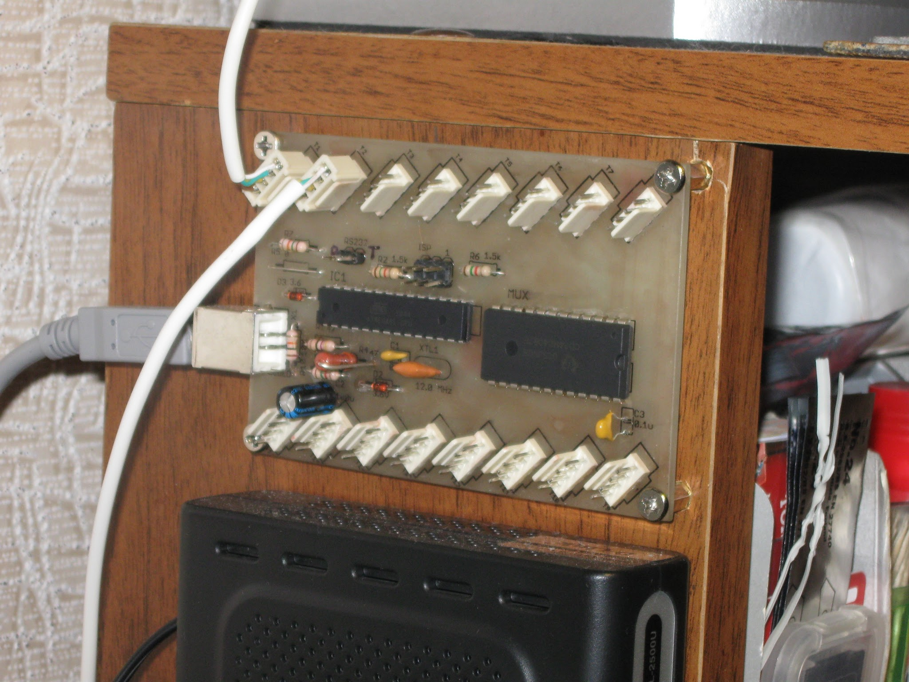
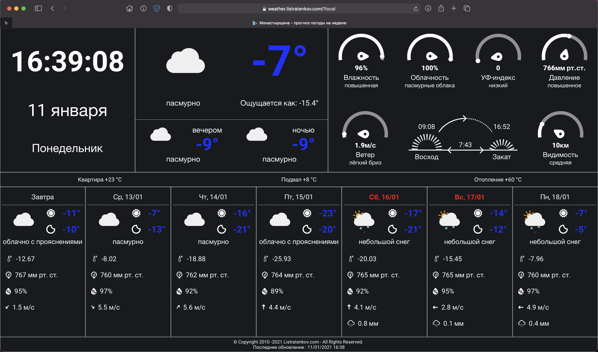

# Weather kiosk app

This application displays the current temperature values in LM-75AD 
sensors via usbtenki-mux made by me based on (https://www.schmut.com/other-stuff/usbtenki-mux).  

Data from sensors is read and values are written to tempX files in the ``public/data`` directory.  
The rest of the weather data is received through the OpenWeatherMap API. For the application to work,  
you need an API key that is specified in .env in the root directory of the application. Also in .env you  
need to specify the coordinates of the location you need to receive weather data.

## Available Scripts
### `npm start`

Runs the app in the development mode. 
Open [http://localhost:3000](http://localhost:3000) to view it in the browser.

### `npm publish`

Build production application and uses the ``deploy.sh`` script to send the compiled application files to a remote webserver.

## Screenshots

